# Palmoria Gender Equality Analysis (Power BI Dashboard)

This Power BI dashboard provides an in-depth analysis of gender equality, pay distribution, and workforce representation within the fictional organization **Palmoria Group**. It focuses on salary, bonuses, ratings, and departmental balance across three major regions: **Abuja**, **Kaduna**, and **Lagos**.

---

## Objectives

- Examine **gender distribution** across regions and departments.
- Highlight disparities in **average salary** and **bonus allocations**.
- Quantify the number of employees **below minimum wage**.
- Visualize **gender pay gaps** and performance by rating level.
- Support HR in making **data-driven equity decisions**.

---

## Key Metrics

| Metric                        | Value                  |
|------------------------------|------------------------|
| Below Minimum Wage           | 559 employees          |
| Average Salary               | ₦73.96K                |
| Total Bonus Distributed      | ₦2 million             |
| Total Employees              | 817                    |
| Gender Pay Gap               | ₦1.76K (in favor of males) |

---

## Visualizations & Features

- **Donut Chart** – Total Employees by Gender
- **Bar Charts** – Salary by Gender, Bonus by Rating, Gender by Department
- **Stacked Columns** – Employees by Region and Gender
- **Column Chart** – Employees by Salary Band
- **KPI Cards** – Salary, Bonus, Pay Gap, Min. Wage Count
- **Interactive Slicers** – Gender, Region, Department, Rating

---
## 📊 Palmoria Gender Equality Dashboard Screenshots

Below are key visual snapshots from the Power BI analysis on gender equality for the Palmoria Group:

| Screenshot | Description |
|------------|-------------|
| 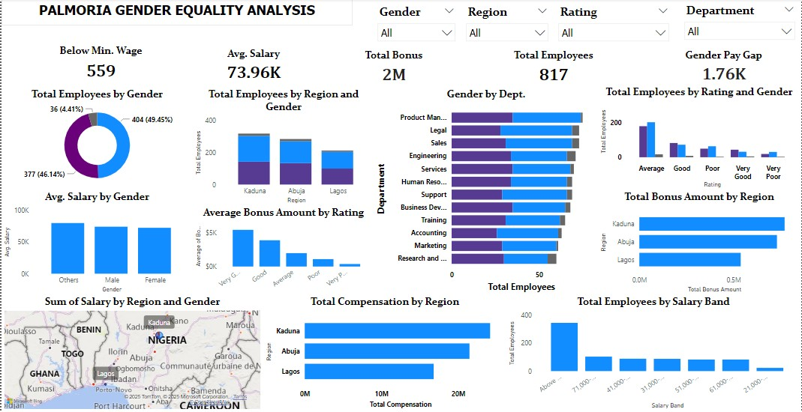 | Full overview of the Palmoria Gender Equality Dashboard |
| 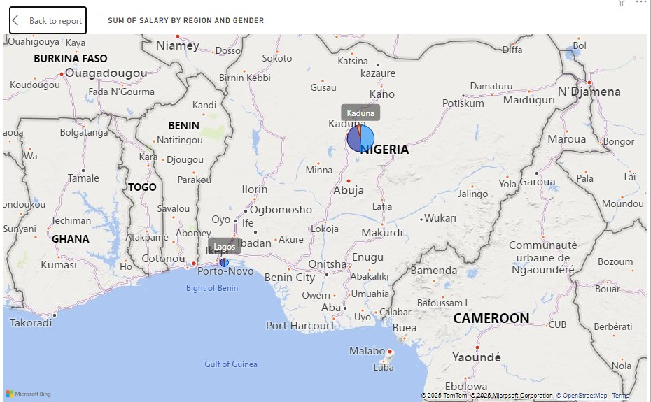 | Salary distribution by region and gender |
| 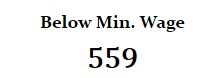 | Number of employees earning below minimum wage |
| 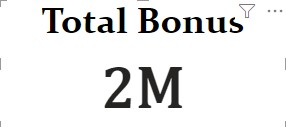 | Total bonus amount distributed |
| 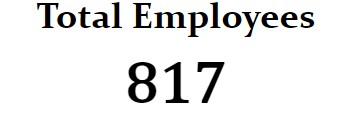 | Overall employee count |
| 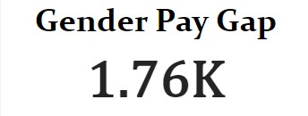 | Gender pay gap key metric |
|  | Average salary overview |
| 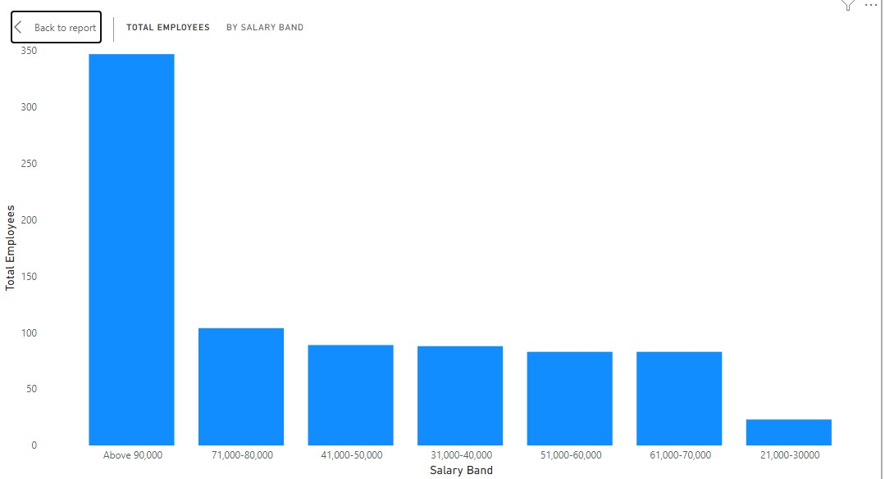 | Employees grouped by salary bands |
|  | Total compensation per region |
| 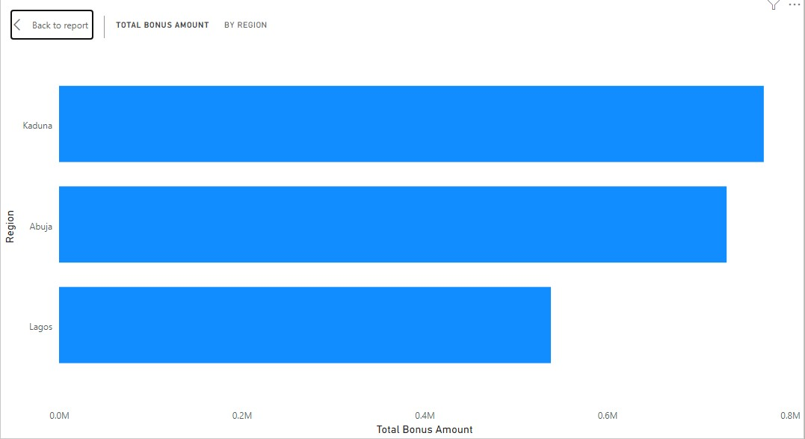 | Bonus amount distributed across regions |
| 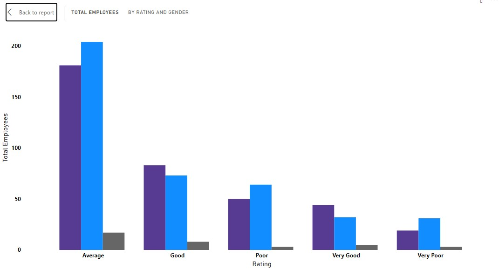 | Performance ratings segmented by gender |
|  | Average salary comparison by gender |
| 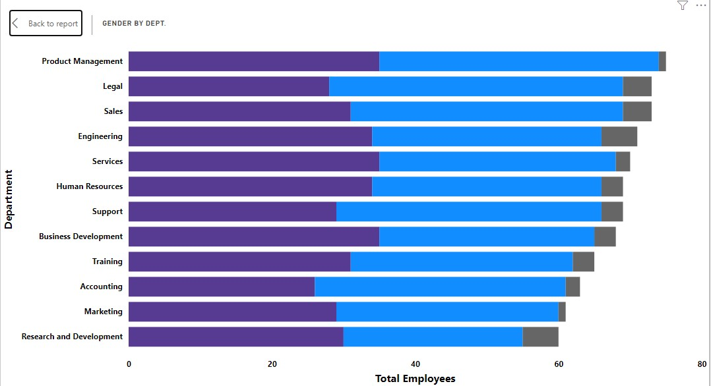 | Departmental gender breakdown |
| 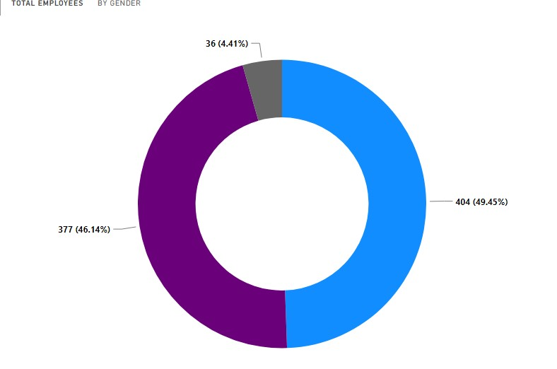 | Gender distribution across all employees |
|  | Consolidated employee count snapshot |
| 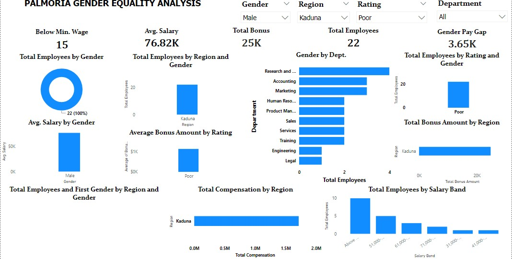 | Example of slicer filters in the dashboard |

---
## Key Insights

- A significant portion of the workforce (559 employees) earns **below minimum wage**.
- **Gender imbalance** exists in departments like Engineering and Accounting.
- **Male employees** have a higher average salary despite similar ratings.
- Bonus amounts **correlate closely with employee performance ratings**.
- Abuja and Kaduna have **higher compensation totals** compared to Lagos.

---

## Tools Used

- **Power BI Desktop**
- DAX for calculated KPIs
- Data Modeling (Region, Gender, Department relationships)
- Custom visuals with dynamic slicers

---

## Note

This dataset is based on **Digital Skill Africa (The Incubator Hub) case study** and was developed for demonstration, training, or case study purposes only.

---

